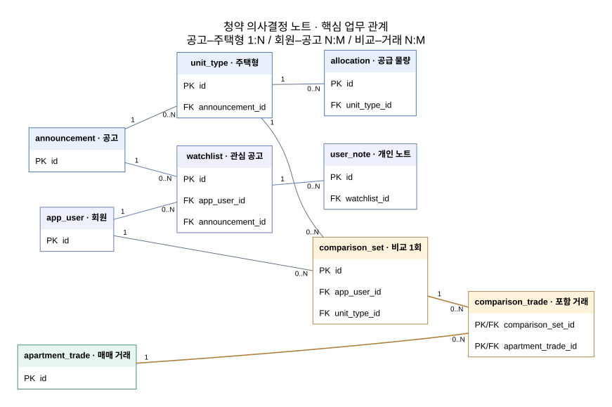

# 청약 의사결정 노트

**2026-2 데이터베이스 프로젝트 · 1차 기획안 · v0.2 · 2026-10-01**

> 공고를 발견하고, 비교 근거를 확인하고, 관심 공고에 대한 판단을 기록하는 개인용 청약 의사결정 서비스.

본 문서는 프로젝트의 방향과 예상 데이터베이스 설계를 제안한다. API 네 개의 개발계정 승인과 실제 표본 응답을 확인했으며, 테이블·컬럼·SQL은 설계 초안이다. DB 적재와 Next.js 앱 구현은 아직 수행하지 않았다. 이후 단계에서 추가 표본과 수업 피드백을 반영하여 보완한다.

## 1. 프로젝트명

**청약 의사결정 노트**

사용자가 지역과 예산에 맞는 아파트 청약 공고를 찾고, 주택형별 가격과 접수 일정, 조건에 맞는 참고 거래를 비교한 뒤 자신의 판단을 기록하는 웹 서비스다.

## 2. 프로젝트 주제 및 비즈니스 모델

### 2.1 주제와 제공 가치

청약 공고, 주택형, 공급 물량, 접수 결과, 매매 거래와 사용자의 개인 기록을 관계형 데이터베이스로 연결한다. 사용자는 “왜 이 공고를 관심 목록에 넣었는가”와 “어떤 자료를 보고 판단했는가”를 다시 확인할 수 있다.

서비스의 중심은 **비교 근거와 판단 기록**이다. 가격을 비교할 때 법정동·면적·기간·거래 건수를 공개하고, 데이터가 부족하거나 아직 확인되지 않은 부분도 표시한다. 접수 이후에는 공개된 경쟁률과 제공되는 당첨가점을 과거 참고 자료로 확인한다.

### 2.2 부분 유료 구독 가설

| 구분 | 제공 가치 | 이번 프로젝트에서의 위치 |
|---|---|---|
| 무료 | 전국 일반 APT 공고 검색·상세, 기본 거래 비교, 관심 목록과 개인 노트 | 최종 앱의 핵심 구현 범위 |
| 유료 가설 | 여러 시점의 비교 이력 보관, 자금 시나리오 비교, 맞춤 일정 알림 | 고급 기능의 가치 제안; 결제·유료 권한 시스템은 구현 범위에서 제외 |

사용자가 지불할 가치는 공공데이터 자체보다 반복적인 비교·기록·일정 관리에 드는 시간을 줄이는 데 있다고 가정한다. 실제 지불 의사, 가격과 전환율은 검증하지 않았으므로 수익 전망 수치를 제시하지 않는다. 이후 인터뷰에서 사용자가 실제로 반복하는 작업과 필요한 기록을 확인한다.

초기 운영비는 서버·DB와 수집 작업에서 발생한다. 공공 API를 서버에서 정해진 범위로 수집하고 화면은 저장된 DB를 조회하는 방식으로 호출량을 관리한다. 상용 운영 여부와 요금은 학기 프로젝트 이후 별도로 검토한다.

## 3. 해결하고자 하는 문제

| 사용자가 겪는 작업상의 문제 | 서비스의 해결 방식 | 필요한 데이터 |
|---|---|---|
| 같은 공고 안에서도 주택형과 공급유형별 조건이 달라 비교가 번거로움 | 공고–주택형–공급 구조로 가격·물량·일정을 정리 | 공고, 주택형, 공급 물량 |
| 분양금액을 어떤 기존 거래와 비교해야 하는지 판단하기 어려움 | 같은 법정동과 확인된 전용면적 조건의 참고 거래·건수·기간을 제공 | 주소 매칭, 법정동, 매매 거래 |
| 여러 공고의 판단 이유와 자금 메모가 흩어짐 | 로그인 후 관심 목록과 개인 노트를 저장 | 사용자, 관심 공고, 노트 |
| 접수 일정과 사후 결과를 다시 찾아야 함 | 관심 공고의 일정과 공개된 접수 결과를 연결 | 공고 일정, 경쟁률, 당첨가점 |
| 시간이 지나면 데이터나 당시 비교 조건이 바뀜 | 수집 이력과 저장한 비교의 조건·선택 거래·당시 값을 보존 | 원본 기록, 수집 실행, 비교 세트 |

이는 서비스에서 해결할 문제 가설이며, 사용자 조사로 빈도와 중요도를 확인할 예정이다. 기존 서비스 전체의 기능이나 사용자 만족도를 조사한 결과로 주장하지 않는다.

## 4. 주요 사용자

주요 사용자는 **관악구와 인접한 서울 서남권에서 아파트 청약을 준비하는 개인**이다. 특히 여러 공고와 주택형을 지역·예산·접수 일정으로 비교하고, 자신의 판단 이유를 남기려는 사용자를 대상으로 한다.

- **조회 사용자:** 로그인 없이 공고와 제공 가능한 참고 거래를 확인한다.
- **회원:** 자신의 관심 목록·메모·저장한 비교를 관리한다. 다른 회원의 기록은 조회·수정하지 못한다.
- **운영자:** 공공데이터 수집 실패와 주소 매칭 미확인 건을 점검한다. 사용자 역할과 외부 데이터 운영 역할을 구분한다.

**사용 예시 — 기능 설명을 위한 가상 시나리오:** 사용자가 관악구·동작구·금천구에서 본인이 정한 예산에 맞는 공고를 찾는다. 한 주택형의 가격과 참고 거래를 확인하고 관심 목록에 저장한 뒤, 보유 현금과 예상 추가 비용을 메모한다. 이후 공개된 접수 결과를 보며 당시 판단을 돌아본다. 실제로 현재 접수 중인 공고가 존재한다는 의미는 아니다.

## 5. 핵심 기능

### 5.1 공고 발견 → 비교 → 기록 → 결과 확인

| 기능 | 사용자 동작과 표시 정보 | 연결되는 DB |
|---|---|---|
| F1. 공고 검색 | 지역·분양최고금액·접수 일정으로 필터하고 일정·가격으로 정렬 | `announcement`, `unit_type`, `address_match`, `region` |
| F2. 공고 상세 | 주택형별 면적·가격·일반/특별공급 물량, 원 공고 링크와 수집 시각 확인 | `announcement`, `unit_type`, `allocation` |
| F3. 참고 거래 비교 | 조건에 맞는 거래의 중앙값·건수·기간과 실제 포함 거래 목록 확인 | `region`, `apartment_trade`, `comparison_set`, `comparison_trade` |
| F4. 관심 목록·개인 노트 | 회원별 관심 공고 추가·조회·상태 변경·삭제, 메모 작성·수정·삭제 | `app_user`, `watchlist`, `user_note` |
| F5. 판단 근거 저장 | 선택한 주택형, 비교 조건, 포함 거래와 당시 사용한 값을 저장 | `comparison_set`, `comparison_trade` |
| F6. 일정·사후 결과 | 관심 공고의 접수 일정과 공개 경쟁률·당첨가점 확인 | `watchlist`, `announcement`, `competition_snapshot`, `winning_score_snapshot` |

공고 상세에는 화면 진입 시각과 별도로 **마지막 정상 수집 시각**을 표시한다. 수집에 실패하면 기존 정상 데이터를 유지하고 실패 상태를 안내한다. 현재 보이는 경쟁률과 결과는 개인의 실제 신청·당첨 여부가 아닌 공개된 공고 단위 자료다. 경쟁률의 접수 건수는 사후 변경될 수 있다는 제공기관 안내를 반영한다. [경쟁률 API 설명](https://www.data.go.kr/data/15098905/openapi.do)

### 5.2 비교 기준과 표시 원칙

| 항목 | 1차 기본안 |
|---|---|
| 공고 범위 | 청약홈의 일반 APT 공고. 무순위·잔여세대·오피스텔·민간임대·사전청약 등은 초기 범위에서 제외하고 원천의 구분 코드로 판별 |
| 거래 비교 지원 지역 | **관악구·동작구·금천구**. 전국 공고 조회와 거래 비교 준비 상태를 구분 |
| 지역 조건 | 공고 주소와 거래가 **같은 법정동**으로 확인된 경우 |
| 면적 조건 | 전용면적임을 확인한 주택형에 대해 전용면적 ±5% |
| 기간 조건 | 판단 기준일에서 12개월 전부터 기준일 전날까지. 기준일 당일·이후 거래는 제외 |
| 취소 거래 | 수집한 자료에서 취소로 확인되는 거래는 제외. 취소 표시를 해석하지 못한 자료는 검증 전 직접 비교에 사용하지 않음 |
| 표본 표시 | 거래 건수·조건·기간을 함께 표시. 0건이면 중앙값은 없음으로 표시 |
| 미확인 처리 | 면적·주소가 미확인이면 직접 비교를 중단하고 사유를 표시. 지역·면적·기간을 몰래 확대하지 않음 |

분양금액은 주택형의 **분양최고금액**이다. 옵션·세금·대출 가능액을 포함한 총 취득비용으로 표현하지 않는다. 기존 아파트 거래의 중앙값은 선택한 조건의 참고 통계이며 신축 분양과 같은 상품의 확정 시세가 아니다. 표본의 단지·준공연도·층도 목록에서 확인할 수 있도록 계획한다.

공식 주택형 CSV는 공급면적과 만원 단위 분양최고금액을 제공한다. 공급면적을 실거래 전용면적과 바로 비교하지 않고, 실제 API와 원 공고에서 전용면적 기준을 확인한다. [주택형 CSV 설명](https://www.data.go.kr/data/15101047/fileData.do)

초기 버전은 청약자격·당첨확률·투자수익을 자동 판정하지 않는다. 자격은 사용자가 확인할 항목과 원 공고 링크로 안내한다. 자금 메모는 사용자가 입력한 현금과 추가 비용을 기록하며, 대출 승인이나 세액 계산을 대신하지 않는다.

### 5.3 실제 데이터로 확인한 실행 가능성

2026년 10월 1일 TypeScript 검증 스크립트로 일반 APT 공고 20건과 연결 자료를 확인했다. 표본인 **천안 아이파크 시티 4단지**는 주택형 5개, 경쟁률 20행, 당첨가점 10행, 특별공급 신청현황 5행을 제공했다. 경쟁률·가점의 모델번호는 해당 공고의 주택형에 모두 연결됐고, 특별공급은 모델번호 대신 공고 안의 주택형 이름의 유일성을 확인했다.

관악구·동작구·금천구의 2026년 8월 거래는 모든 페이지를 조회하여 각각 120·123·108건, 총 **351건**을 확인했다. 세 구의 공식 법정동 목록과 거래의 법정동 코드도 대조했다. 이것은 전국·최근 12개월 전체 적재나 공고 주소 매칭을 완료했다는 뜻은 아니다. 주택형 전용면적의 근거도 아직 미확인으로 남긴다.

[실제 검증 결과와 한계](data-validation.md#5-실제-검증-기록)와 [키를 제외한 실행 요약](../docs/api/latest-validation.json)에 조건·건수·필드·연결 확인 결과를 기록했다.

## 6. 예상 테이블 구성 및 데이터 구조

### 6.1 데이터 흐름과 저장 단위

```text
공공 API / 공식 CSV
  → 수집 실행 기록과 원본 항목 보존
  → 식별자·단위·날짜·취소 여부 검증
  → 공고·주택형·공급·결과 / 지역·거래로 정규화
  → PostgreSQL의 검색·집계 SQL
  → Next.js 서버의 조회·권한 처리 → Next.js / React 화면
  → 회원의 관심 목록·노트·비교 근거 저장
```

공고와 매매 거래는 서로 다른 원천의 독립적인 사실이다. 거래에 `announcement_id`를 붙여 공고의 자식으로 만들지 않고, 확인된 지역·면적·기간으로 선택한 거래를 비교 세트에 연결한다.

### 6.2 예상 테이블 15개

아래의 영문 컬럼명은 내부 DB 설계 후보이며 실제 API의 응답 필드명이 아니다. `id`는 내부 PK, `*_id`와 `region_code`는 명시한 대상의 FK 후보다. 표본에서 공고·모델 연결을 확인했으며 전체 명세와 결과 데이터의 자연키는 추가 검증 후 3차에 확정한다.

| # | 테이블 · 한 행의 의미 | PK / FK 후보 | 주요 속성과 필요성 |
|---|---|---|---|
| 1 | `announcement` · 원천에서 식별되는 공고 1건 | PK `id`; FK `last_source_record_id` → 원본 | `source`, `house_manage_no`, `notice_no`, 이름, 원문 주소, 접수 날짜, 원 공고 URL, `is_active`, 마지막 수집 시각. 반복되는 공고 정보를 주택형에서 분리 |
| 2 | `unit_type` · 공고 내 모델 1개 | PK `id`; FK `announcement_id`, `last_source_record_id` | `model_no`, 주택형 원문, `supply_area_m2`, `exclusive_area_m2`, `exclusive_area_confirmed`, `max_price_won`. 가격·면적의 비교 단위 |
| 3 | `allocation` · 주택형의 공급 세부유형 1개 | PK `id`; FK `unit_type_id`, `last_source_record_id` | `supply_category`, `household_count`. 일반공급과 특별공급 세부유형 물량을 행으로 관리 |
| 4 | `competition_snapshot` · 특정 주택형·유형·순위·거주지역의 관측 결과 | PK `id`; FK `unit_type_id`, `source_record_id` | 공급유형, 순위, 거주지역 구분, 공급수, 신청수, 경쟁률, `captured_at`. 결과 변경 전후의 관측을 보존 |
| 5 | `winning_score_snapshot` · 특정 주택형·결과 구분의 가점 관측 | PK `id`; FK `unit_type_id`, `source_record_id` | 거주지역 등 원천의 결과 구분, 최소·최대·평균 가점, `captured_at`. 경쟁률과 다른 측정값을 별도로 보관 |
| 6 | `region` · 법정동 코드 체계의 지역 1개 | PK `region_code`; FK `parent_code` → 자신, `last_source_record_id` | 지역명, 지역 단계, 사용 여부. 시도–시군구–법정동 계층과 동일 코드 기준을 관리 |
| 7 | `address_match` · 공고 주소의 지역 매칭 시도 1회 | PK `id`; FK `announcement_id`, nullable `region_code` | 원문·표준화 주소, 매칭 방법·상태·시각, `is_current`. 매칭 실패·수정 이유를 남기고 현재 결과를 구분 |
| 8 | `apartment_trade` · 원천에서 구분한 실제 거래 1건 | PK `id`; FK `region_code`, `last_source_record_id` | 아파트명, 거래일, `price_won`, `exclusive_area_m2`, 층·준공연도, `is_cancelled`, 원천 식별 정보. 독립적인 비교 대상 |
| 9 | `app_user` · 회원 1명 | PK `id` | 로그인 식별자, `password_hash`, 생성 시각. 회원별 기록의 소유자를 구분 |
| 10 | `watchlist` · 회원이 저장한 공고 1건 | PK `id`; FK `app_user_id`, `announcement_id` | 검토 상태, 저장 시각. 사용자–공고 N:M 관계를 해소 |
| 11 | `user_note` · 관심 공고의 메모 1건 | PK `id`; FK `watchlist_id` | 내용, 보유 현금, 사용자가 예상한 추가 비용, 작성·수정 시각. 하나의 관심 공고에 여러 판단을 기록 |
| 12 | `comparison_set` · 회원이 저장한 주택형 비교 1회 | PK `id`; FK `app_user_id`, `unit_type_id`, `region_code` | 기준일·기간·면적 조건, 당시 주택형 면적·분양금액, 생성 시각. 같은 주택형도 시점별 비교를 구분 |
| 13 | `comparison_trade` · 비교에 포함한 거래와 당시 사용한 값 | 복합 PK/FK `(comparison_set_id, apartment_trade_id)`; FK `source_record_id` | 당시 거래일·가격·전용면적·취소 상태. 비교 세트–거래 N:M을 해소하고 판단 근거를 보존 |
| 14 | `ingestion_run` · 수집 작업 실행 1회 | PK `id` | 서비스·조회 범위, 시작·종료 시각, 성공/실패, 처리 건수, 키를 제거한 오류 정보. 실패·재시도를 추적 |
| 15 | `source_record` · 수집 응답의 원본 항목 관측 1건 | PK `id`; FK `ingestion_run_id` | 기능명, 외부 키 후보, 원본 JSON/XML, 형식, 내용 해시, 관측 시각. 정규화 오류의 재처리와 출처 추적 |

`address_match.region_code`는 매칭 실패 시 비어 있을 수 있다. `apartment_trade`에는 지역·필수 비교 필드가 확인된 거래를 적재하고, 해석하지 못한 원본은 `source_record`에 남겨 재검토한다. 결과 스냅샷은 원천이 실제로 구분하는 순위·거주지역·공급유형을 확인한 뒤 고유키를 결정한다.

### 6.3 ERD 초안



위 그림은 15개 중 핵심 업무 테이블 9개와 관련 PK/FK를 표시한다. 지역·결과 관측·수집 이력과 나머지 FK는 [15개 테이블 전체 ERD](../docs/erd/proposal-erd.svg)에서 확인할 수 있다.

[핵심 관계 확대 SVG](../docs/erd/core-relationships.svg) · [전체 ERD PNG](../docs/erd/proposal-erd.png) · [전체 Mermaid 원본](../docs/erd/proposal-erd.mmd)

SVG 그림에서 `1`은 자식에서 부모를 1건 참조함을, `0..N`은 부모에 자식이 없거나 여러 건 연결됨을 나타낸다. 전체 그림의 주소 매칭 지역 참조는 실패 시 `0..1`이다. 전체 SVG의 실선은 업무 관계, 점선은 원본 출처 추적 FK이며 이 FK도 1:N이다. Mermaid 원본은 별도로 실선/점선을 식별/비식별 관계 표기에 사용한다.

| 관계 | 설계 이유 |
|---|---|
| 공고 1:N 주택형, 주택형 1:N 공급 물량 | 하나의 공고에 여러 모델이 있고 각 모델에 여러 공급유형이 존재 |
| 회원 N:M 공고 → `watchlist` | 여러 회원이 같은 공고를 저장하며 한 회원도 여러 공고를 저장 |
| 관심 공고 1:N 노트 | 검토 과정에서 판단·자금 메모를 여러 차례 남길 수 있음 |
| 주택형 1:N 비교 세트 | 같은 주택형도 비교 시점과 조건에 따라 포함 거래가 달라짐 |
| 비교 세트 N:M 거래 → `comparison_trade` | 한 비교에 여러 거래가 포함되고 한 거래도 여러 비교에 사용 |
| 주택형 1:N 결과 관측 | 같은 결과 구분의 값이 수집 시점에 따라 달라질 수 있음 |
| 수집 실행 1:N 원본 기록 | 한 작업이 여러 원본 항목을 확보하고 실패·재처리의 원인을 추적 |

### 6.4 키·타입·무결성의 선택 이유

- **내부 PK와 외부 키를 구분한다.** 공고에는 내부 `id`를 두고 `(source, house_manage_no, notice_no)`를 고유키 후보로 삼는다. 외부 번호는 계산 대상이 아니므로 문자열로 보존한다. 모델 번호도 앞자리와 원문을 유지하고 `(announcement_id, model_no)`의 유일성을 표본으로 검증한다.
- **FK는 없는 부모를 참조하는 기록을 막는다.** 존재하지 않는 공고의 주택형, 없는 회원의 관심 목록, 없는 비교 세트의 포함 거래를 저장할 수 없도록 한다.
- **중복 관심 공고를 막는다.** `UNIQUE(app_user_id, announcement_id)`를 두어 같은 회원이 같은 공고를 중복 저장하지 않게 한다. `allocation`의 `(unit_type_id, supply_category)`도 고유키 후보로 둔다.
- **현재 주소 매칭은 공고당 최대 1건이다.** 과거 시도는 보존하고 `is_current = true`인 행에 공고 ID의 부분 고유 인덱스를 검토한다. 미확인 지역은 `NULL`로 표시한다.
- **값의 의미에 맞는 타입을 사용한다.** 원 단위 금액은 `BIGINT`, 면적·경쟁률·가점은 `NUMERIC`, 일정·거래일은 `DATE`, 수집 시각은 `TIMESTAMPTZ`를 후보로 사용한다. API의 만원 단위 금액은 확인 후 10,000을 곱해 변환하고 원문도 보존한다.
- **미제공과 0은 다르다.** 미확인 가격·면적·신청수·가점은 `NULL`로 두고, 실제 0건과 구분한다. 금액·세대수는 음수 금지, 확인된 면적은 양수, 기간은 시작일 ≤ 종료일 등의 `CHECK`를 계획한다.

거래의 고유키는 특히 주의한다. 단지명·날짜·면적·층·가격이 같은 별개 거래가 존재할 수 있으므로 이 값들만으로 무조건 중복 제거하지 않는다. 공식 거래 식별자 유무와 정정·취소 표현을 실제 응답에서 확인하고 적재 규칙을 확정한다.

### 6.5 정규화와 이력 보존

3차 설계에서 함수적 종속성을 검토하고 3NF를 목표로 한다. 1차에서는 다음 분리의 이유를 설명한다.

1. **공고와 주택형:** 공고 ID가 결정하는 이름·주소·일정을 주택형마다 복사하면 공고 변경 시 여러 행을 함께 수정해야 한다. 공고는 한 곳에 보관하고 주택형에서 FK로 참조한다.
2. **주택형과 공급 물량:** 주택형별로 반복되는 공급 세부유형을 `allocation`의 행으로 표현한다. 일반공급과 특별공급 세부유형을 같은 기준으로 집계하되, 특별공급 합계와 그 세부유형 물량을 동시에 더하지 않는다.
3. **회원과 관심 공고:** 공고 테이블에 사용자 목록을 문자열로 저장하지 않고 연결 테이블로 관리한다. 한 회원의 관심 삭제가 다른 회원이나 원 공고에 영향을 주지 않게 한다.

`comparison_trade`의 당시 가격·면적은 현재 거래 값의 캐시가 아니라 **그 비교에서 사용한 과거 사실**이다. 현재 거래가 정정되어도 저장한 판단 근거는 유지하고, 최신 정보와 달라졌다면 차이를 안내한다. 변경된 거래를 계속 현재 비교에 사용할 수 있다는 의미는 아니다.

### 6.6 실제 기능으로 보여줄 SQL

| 질의 | 업무 질문 | 활용 개념 |
|---|---|---|
| Q1 | 관심 지역의 접수 예정 공고 중 예산에 맞는 주택형과 조건에 맞는 거래 건수·중앙값은? | JOIN, CTE, 상관 서브쿼리, 집계 |
| Q2 | 공고별 일반/특별공급 세부유형의 공급 물량은? | JOIN, GROUP BY, SUM |
| Q3 | 검색한 공고 중 내가 아직 관심 목록에 넣지 않은 것은? | NOT EXISTS 서브쿼리 |
| Q4 | 주택형·유형·순위·거주지역별 가장 최근에 수집한 경쟁률은? | 결과 구분별 최신 행 선택; 필요 시 윈도 함수 |

[Q1~Q3 SQL 초안](../database/proposal-queries.sql)을 별도 파일로 제공한다. 내부 컬럼 후보에 대한 설명용 SQL이며, 실행 결과나 성능 검증 자료는 아니다. Q1은 주소가 법정동으로 확인된 공고를 대상으로 하고, 전용면적이 미확인된 주택형의 비교 건수는 `NULL`, 조건을 확인했으나 거래가 없는 경우는 `0`으로 구분한다. 전체 공고 조회 화면에서는 주소 미확인 공고도 확인 상태와 함께 표시할 계획이다.

중앙값은 PostgreSQL의 `percentile_cont(0.5)`를 이용하는 방안을 검토한다. [PostgreSQL 집계 함수 문서](https://www.postgresql.org/docs/current/functions-aggregate.html)

### 6.7 인덱스와 트랜잭션

| 적용 후보 | 필요한 이유와 검증 방법 |
|---|---|
| `apartment_trade(region_code, trade_date, exclusive_area_m2)` | 법정동 일치 후 기간·면적 조건으로 후보를 줄이는 질의. 범위 조건의 순서와 효과는 실제 데이터의 `EXPLAIN (ANALYZE, BUFFERS)`로 비교 |
| `unit_type(announcement_id, max_price_won)` | 공고별 주택형 연결과 가격 조건 조회를 지원 |
| `watchlist(app_user_id, announcement_id)`의 고유 인덱스 | 회원별 관심 조회와 중복 저장 방지에 함께 사용 |
| 결과 구분 키 + `captured_at DESC` | 같은 결과 구분의 최신 관측 조회. 실제 응답 차원을 확인한 뒤 키 구성 |

인덱스는 모든 컬럼에 만들지 않고 대표 검색·집계 질의의 실행계획과 쓰기 비용을 근거로 결정한다. 작은 데이터에서는 순차 스캔이 더 적절할 수 있으므로 성능 향상 수치를 미리 주장하지 않는다.

비교 저장에서는 **비교 세트와 포함 거래·당시 값이 모두 저장되거나 모두 취소**되어야 한다. 하나의 DB 트랜잭션으로 저장하고 도중에 실패하면 롤백한다. 저장 도중 수집 작업이 거래를 갱신하더라도 읽은 데이터의 시점을 일관되게 유지하도록 격리 수준을 검토한다. 사용자별 관심·노트 변경도 소유권 확인 후 처리한다.

수집은 원본을 먼저 남기고 검증에 통과한 공고·주택형·공급 정보를 업무 단위로 반영한다. 실패한 호출을 빈 응답으로 간주하여 기존 데이터를 지우지 않는다. 재수집의 중복 처리, 변경된 결과 보존, 부모·자식 적재 순서를 함께 검증한다.

## 7. 향후 구현 계획

### 7.1 기술 구성과 선택 근거

| 구성 | 예정 기술 | 선택 이유 |
|---|---|---|
| 관계형 DB | PostgreSQL | PK/FK·제약조건·트랜잭션과 중앙값 집계를 직접 설명하고 실행계획을 비교하기 적합 |
| 풀스택 웹·서버 | Next.js App Router / TypeScript | 화면과 서버 조회·입력·권한 처리를 한 프로젝트에서 관리 |
| 서버 수집 모듈 | TypeScript / Node.js | 실제 검증한 JSON/XML 호출 코드를 Next.js 서버 작업에서도 재사용 |
| 웹 화면 | Next.js의 React 화면 | 검색·상세·비교 목록·개인 기록의 상태와 입력을 구성 |
| 수집 실행 | 독립 Node.js 수집 명령·예약 실행 | 화면 조회마다 외부 API를 호출하지 않고 실패·재시도를 관리 |

Next.js의 [서버·클라이언트 구성](https://nextjs.org/docs/app/getting-started/server-and-client-components)과 [환경변수 처리](https://nextjs.org/docs/app/guides/environment-variables)를 기준으로 서버 인증키와 DB 접근을 관리한다. 현재는 서버 API 모듈·독립 검증 스크립트까지 구현했으며 Next.js 앱 자체는 향후 구현한다. 주요 질의는 바인드 매개변수를 사용한 SQL로 관리한다. 지도·PostGIS는 초기 필수 범위가 아니다.

### 7.2 단계별 산출물

개인 프로젝트, **주 5~8시간**을 기준으로 기능을 누적한다. 10월 10일은 앞선 전체 안내의 1차 준비 목표이며, 실제 발표 일시는 최신 공지를 따른다. 후속 발표 일정도 예정 일정이다.

| 단계 | 준비 목표 | 산출물·확인 내용 |
|---|---|---|
| 1차 · 10월 10일 준비 목표 | 기획의 목적과 DB 활용 방향 설명 | 필수 7개 항목, ERD 초안, 데이터 출처·제약, 완료한 API 표본 확인과 남은 위험, 발표·Q&A |
| 2차 · 10월 말 예정 | 요구사항과 화면 흐름 구체화 | 실제 API 필드 매핑, 초기 적재, 검색·상세·관심 목록·노트의 동작, 피드백에 따른 ERD 변경 기록 |
| 3차 · 11월 말 예정 | DB 분석·설계 확정 | 테이블·타입·키 명세, 정규화 근거, 제약조건, 주요 SQL, 인덱스 전후 실행계획, 트랜잭션 실패 테스트 |
| 4차 · 12월 말 예정 | 통합 앱과 설계 설명 완성 | 비교 근거 저장·결과 이력·실패 대응 시연, 재현 가능한 샘플과 실행 방법, 변경 과정·회고 |

범위 확장은 핵심 기능의 완료 여부를 기준으로 결정한다. 거리 기반 비교, 임대·분양권 거래, 학교·역 정보, 결제와 실제 외부 알림 발송은 초기 MVP에서 제외한다. 유료 가치 제안 중 구현하지 못한 기능은 향후 확장으로 명시한다.

### 7.3 검증할 위험과 대응

| 위험 | 대응과 확인할 증거 |
|---|---|
| 전용면적을 확정할 수 없는 주택형 | 공급면적을 따로 보관하고 전용면적 확인 근거를 기록; 직접 비교를 중단 |
| 주소를 법정동으로 연결하지 못함 | 매칭 실패·방법을 기록; 국가 코드와 확인한 주소로 재검토. 청약홈 공급지역코드를 거래 코드로 바로 사용하지 않음 |
| 거래 정정·취소 또는 식별자 부족 | 원본 보존과 표본 검증으로 식별 규칙 확정; 진짜 동일 조건 거래와 재수집 중복을 구분 |
| 비교 지역에 현재 접수 예정 공고가 없음 | 전국 공고 조회와 지역 비교를 구분; 과거 실제 공고로도 시연하며 당시 일정임을 표시 |
| 경쟁률·가점 자료 미제공 또는 지연 | 아직 제공되지 않은 값과 0을 구분하고 수집 시각을 표시 |
| API 실패·승인 지연 | 미검증 상태를 명시하고 공식 CSV로 가능한 초기 구조 검토를 진행; 앱은 마지막 정상 데이터 유지 |

VWorld 지오코더 공식 문서의 응답 저장 제한을 반영하여 좌표 영구 적재를 제외했다. 처음에는 같은 법정동 비교로 진행하고, 거리 비교는 저장·활용이 가능한 좌표 출처를 확인한 뒤 별도로 설계한다. [VWorld 공식 문서](https://www.vworld.kr/dev/v4dv_geocoderguide2_s001.do)

### 7.4 완료 기준과 시연 계획

| 검증 장면 | 기대 결과 | 확인할 DB 개념 |
|---|---|---|
| 실제 공고와 여러 주택형 적재 | 외부 키로 정확히 연결되고 반복 수집해도 업무 데이터가 불필요하게 증가하지 않음 | PK/FK, 고유 제약, 적재 |
| 예산·지역·일정 검색 | 조건에 맞는 주택형이 반환되고 결과가 없는 경우도 명확히 표시 | JOIN, 필터·정렬 |
| 참고 거래 비교 | ±5%와 12개월 조건, 포함 거래·건수·중앙값을 확인 | 서브쿼리·집계, N:M |
| 전용면적 미확인·거래 0건·취소 거래 | 미검증과 0건을 구분하고 취소 거래를 제외 | NULL, 데이터 무결성 |
| 회원 2명의 관심·노트 CRUD | 재접속 후에도 유지되며 다른 회원의 기록을 수정할 수 없음 | 사용자–공고 관계, CRUD |
| 비교 저장 중 의도적인 오류 | 비교 세트와 포함 거래가 모두 롤백 | 트랜잭션의 원자성 |
| 저장 후 원천 가격·취소 상태 변경 | 현재 비교는 갱신되지만 저장한 당시 근거는 보존 | 관측 이력, 시점별 사실 |
| API 실패·작은/큰 표본에서 질의 실행 | 정상 데이터 유지; 실행계획과 인덱스 효과를 실제 측정 | 실패 처리, 인덱스 |

위 장면은 **향후 검증 계획**이다. 이번 1차에서는 목적·사용자·기능·테이블의 필요성이 연결되고, 검증 상태를 솔직하게 설명하며, 약 10분 발표와 설계 질문에 답할 수 있는 상태를 완료 기준으로 삼는다.

## 8. 데이터 출처와 추가 자료

API 4개의 개발계정 활용신청·승인을 확인했으며 [API 검증 부록](data-validation.md)에 실제 확인 결과를 누적한다. 공식 CSV는 과거 초기 자료로 활용할 예정이며 파일 다운로드·파싱은 아직 수행하지 않았다. 현재 일정은 본 API에서 확인한다.

| 공식 자료 | 사용할 내용 |
|---|---|
| [한국부동산원 청약홈 분양정보 API](https://www.data.go.kr/data/15098547/openapi.do) | APT 공고와 주택형별 분양정보 |
| [청약홈 분양정보 기술문서 안내](https://www.reb.or.kr/reb/na/ntt/selectNttInfo.do?mi=10251&bbsId=1268&nttSn=79889) | 최신 기능·필드·코드 확인 |
| [청약접수 경쟁률 및 특별공급 신청현황 API](https://www.data.go.kr/data/15098905/openapi.do) | 접수 결과와 변경 가능성 |
| [경쟁률·특별공급 기술문서 안내](https://www.reb.or.kr/reb/na/ntt/selectNttInfo.do?mi=10251&bbsId=1268&nttSn=82345) | 경쟁률·특별공급·당첨가점 기능 확인 |
| [국토교통부 아파트 매매 실거래가 상세 API](https://www.data.go.kr/data/15126468/openapi.do) | 법정동 앞 5자리·계약년월별 XML 거래 자료 |
| [행정안전부 법정동코드 API](https://www.data.go.kr/data/15077871/openapi.do) | 지역 코드와 계층 |
| [APT 공고 CSV](https://www.data.go.kr/data/15101046/fileData.do), [APT 주택형 CSV](https://www.data.go.kr/data/15101047/fileData.do) | 주택관리번호로 연결되는 과거 초기 자료 |

공식 자료는 **2026-09-29**에 확인했고, 실제 호출은 **2026-10-01**에 재검증했다. 포털 설명·CSV 항목 정의·청약홈 OpenAPI 명세와 실제 응답 표본을 확인했다. 첨부 기술문서 전체와 모든 과거·경계값 사례를 검증한 것은 아니다. 실행 방법과 남은 작업은 [Next.js 서버 연동 안내](../app/README.md)에 정리했다.

[발표 흐름·대본·예상 Q&A](presentation.md) · [API 신청·검증 부록](data-validation.md)
